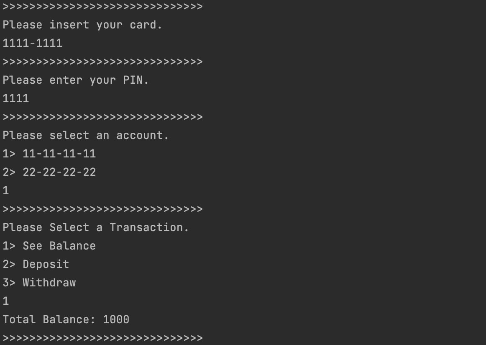
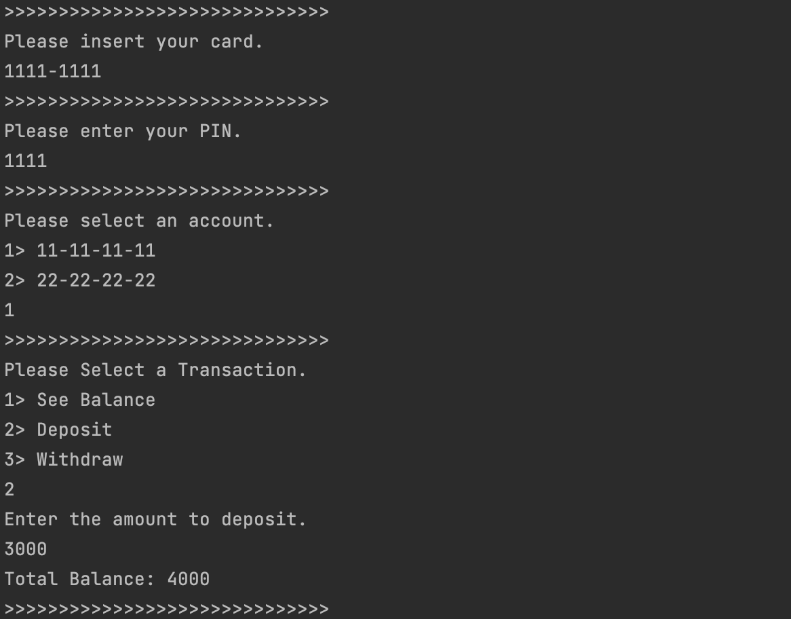
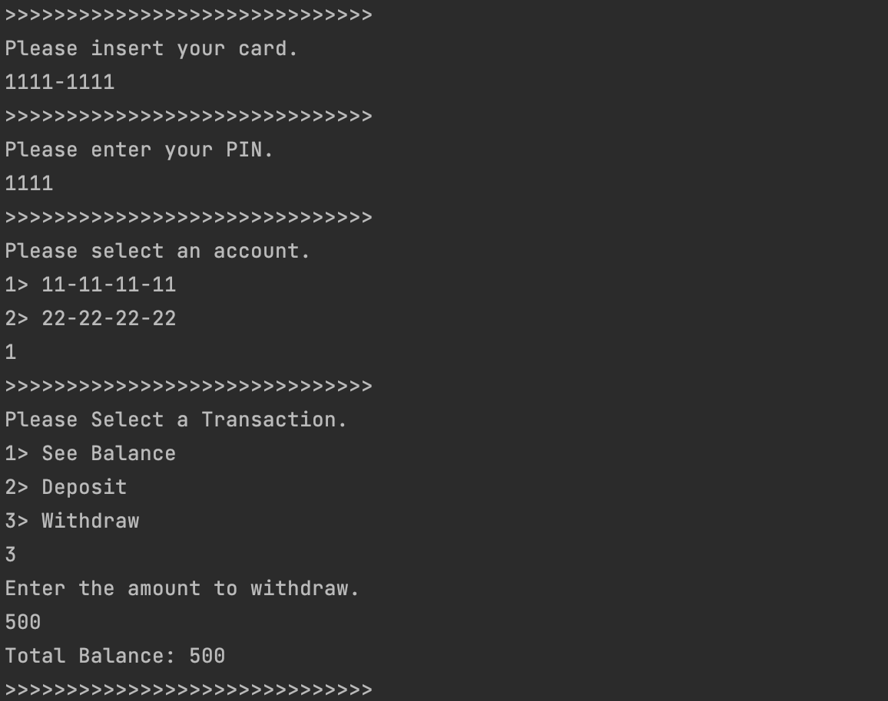
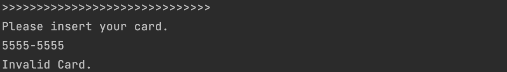
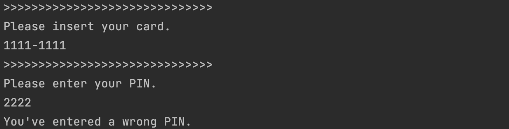
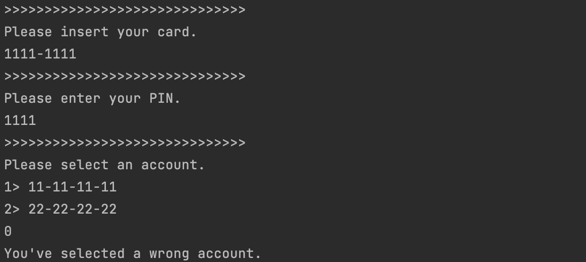
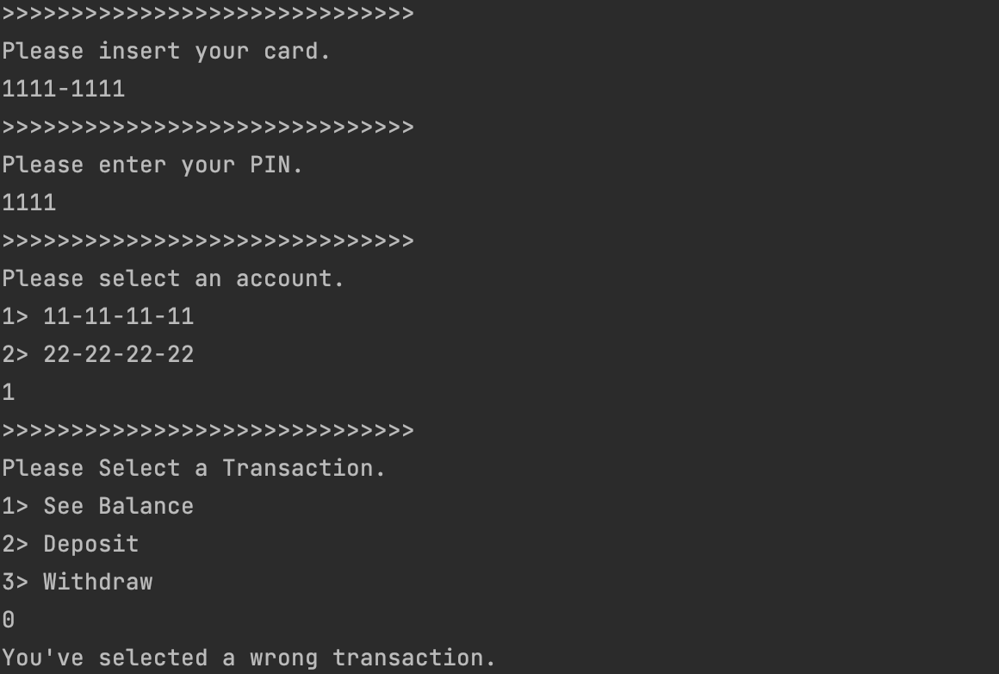
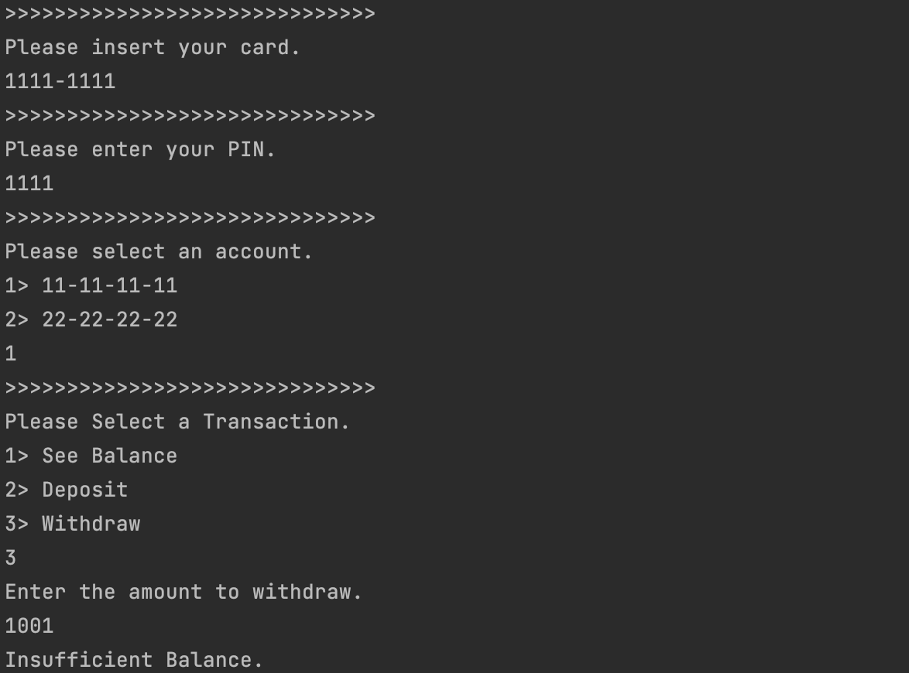

# Implement a simple ATM controller

Write code for a simple ATM. It doesn't need any UI &#40;either graphical or console&#41;, but a controller should be
implemented and tested.

## File Structure

```
├── src
│   ├── account.py
│   ├── atm.py
│   ├── card.py
│   └── exception.py
├── README.md
└── test.py 
```

## How to Test it

```shell
git clone https://github.com/sieukim/Implement-a-simple-ATM-controller
cd Implement-a-simple-ATM-controller
python3 test.py 
```

## Test Data

**Card**

| Card Name | Card Number | Password | Linked Account                          |
|-----------|-------------|----------|-----------------------------------------|  
| Card1     | 1111-1111   | 1111     | Account1, Account2                      | 
| Card2     | 2222-2222   | 2222     | Account1, Account3                      | 
| Card3     | 3333-3333   | 3333     | Account1, Account4                      |
| Card4     | 4444-4444   | 4444     | Account1, Account2, Account3, Account4  |

**Account**

| Account Name  | Account Number | Balance |
|---------------|----------------|---------|
| Account1      | 11-11-11-11    | 1000    |
| Account2      | 22-22-22-22    | 2000    | 
| Account3      | 33-33-33-33    | 3000    | 
| Account4      | 44-44-44-44    | 4000    | 

## Test Result

1) See Balance
   
2) Deposit
   
3) Withdraw
   

## Exception Case

1) Invalid Card Number
   
2) Invalid Password
   
3) Invalid Account Number
   
4) Invalid Transaction
   
5) Invalid Balance
   